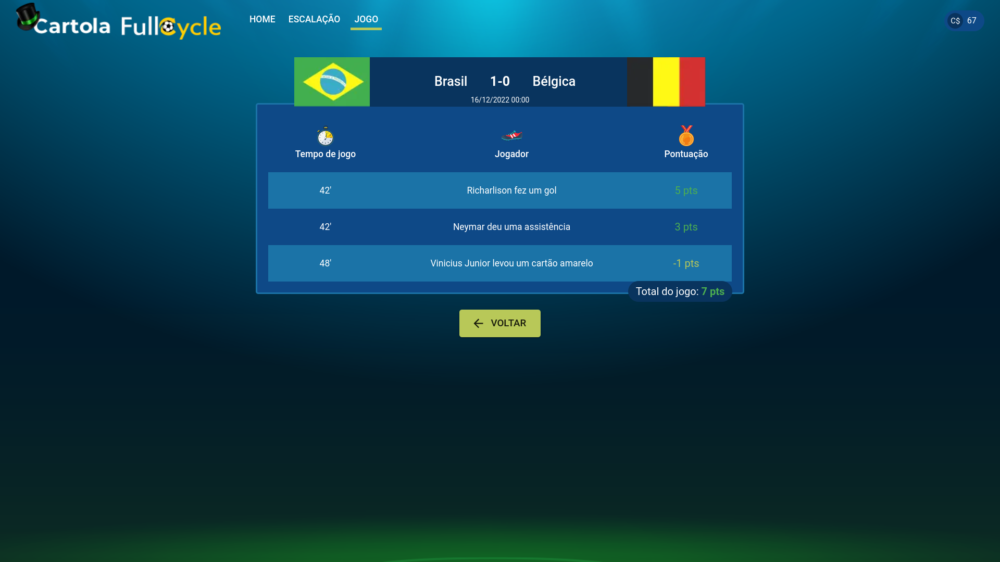
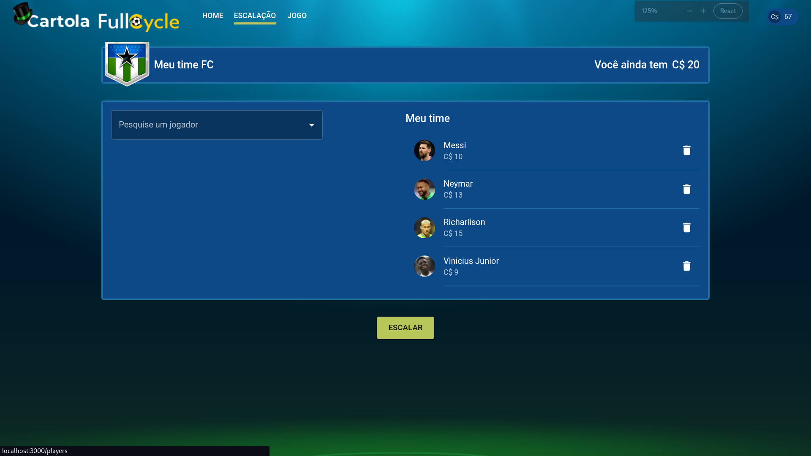

Imersão Full Cycle

<h1 align="center">
    Cartola Full Cycle
</h1>

    Projeto desenvolvido durante a Imersão Full Cycle com o objetivo de aprimorar os conhecimentos sobre a arquitetura de microserviços e integração de diferentes tecnologias, principalmente o Kafka, solução utilizada para mensageria assíncrona entre os serviços, Através do desenvolvimento de um clone simplificado do <a href="https://ge.globo.com/cartola/">Cartola FC</a>.

    
    

## 🛠️ Tecnologias utilizadas

- Next.js & Typescript
- Kafka
- Docker
- Golang
- Django & Python

## 🏃 Executar localmente

As instruções para executar cada projeto está no README na pasta de cada um.

A ordem correta para executá-los é:

1. Kafka
2. Django
3. Golang
4. Next.js